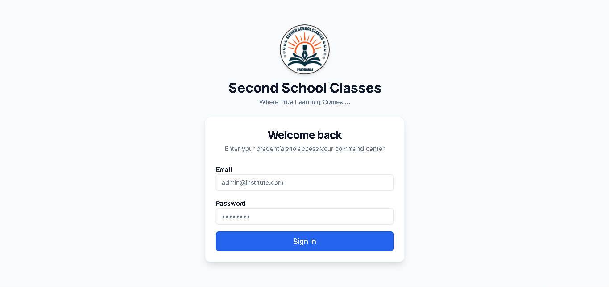
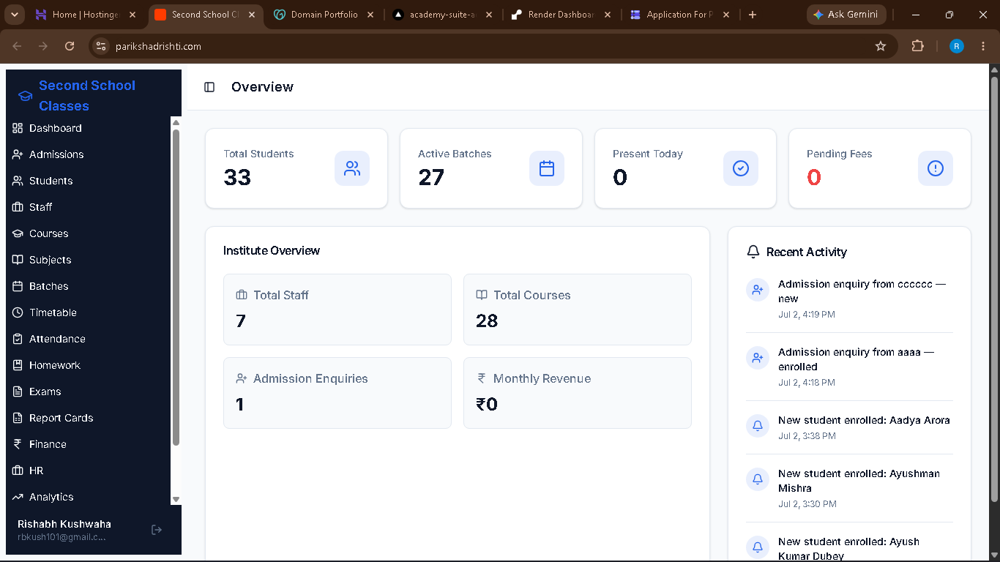
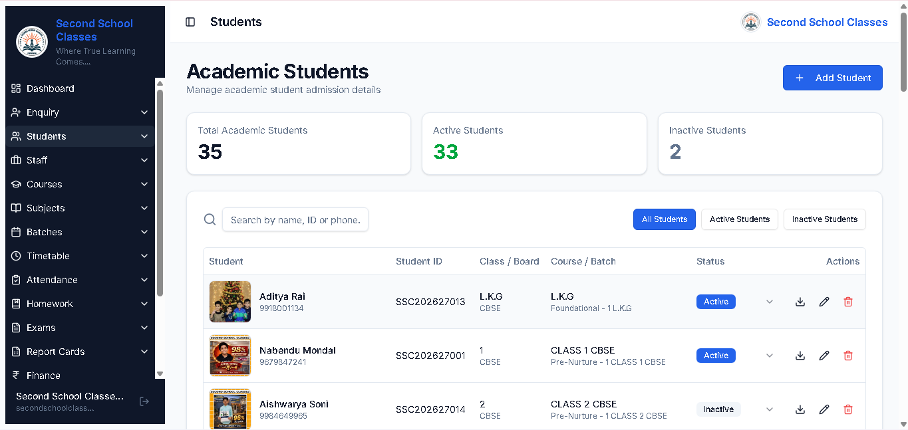
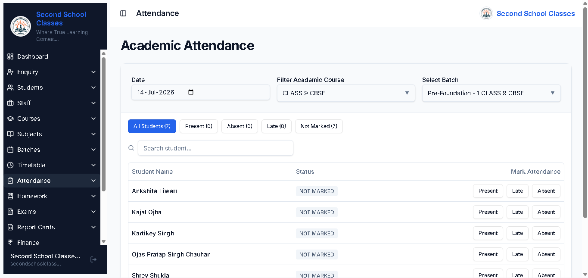
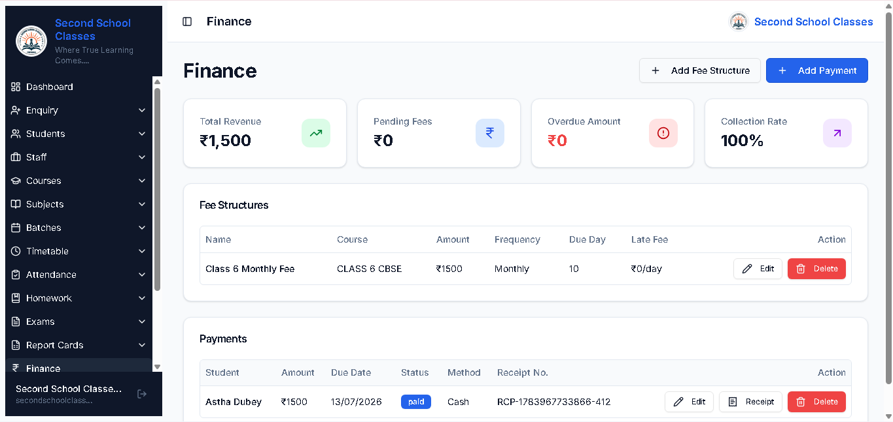
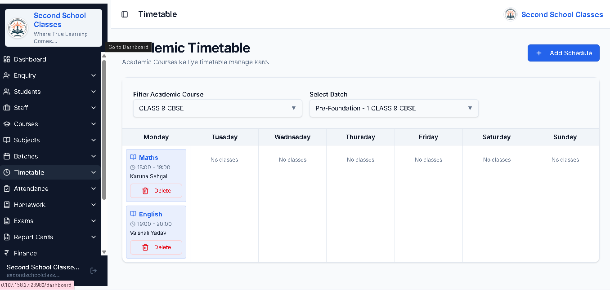

# 📚 ParikshaDrishti – Academy Management System


A production-ready **Academy Management System** built using the **MERN Stack (MongoDB, Express.js, React.js, Node.js)**.

## 📖 About the Project

ParikshaDrishti is a full-stack Academy Management System developed using the MERN Stack (MongoDB, Express.js, React.js, and Node.js).

The system helps educational institutes manage students, enquiries, courses, attendance, examinations, finance, report cards, homework, and timetables through a secure admin dashboard.

---

## 🌐 Live Demo

👉 https://www.parikshadrishti.com

---

## 📂 GitHub Repository

👉 https://github.com/rbkush101-a11y/academy-suite

---

# ✨ Features

- 🔐 JWT Authentication
- 👨‍🎓 Student Management
- 📝 Admission & Enquiry Management
- 👨‍🏫 Staff Management
- 📚 Courses & Subjects
- 👥 Batch Management
- ✅ Attendance Management
- 📖 Homework Management
- 📝 Examination Management
- 🎓 Report Cards
- 💰 Finance Management
- 📅 Timetable Management
- 📊 Analytics Dashboard
- 📱 Responsive Design

---

# 🛠 Tech Stack

## Frontend

- React.js
- HTML5
- CSS3
- JavaScript

## Backend

- Node.js
- Express.js

## Database

- MongoDB

## Authentication

- JWT (JSON Web Token)

## Deployment

- Vercel
- Render

---

# 📸 Screenshots

## 🔐 Login Page



## 📊 Dashboard



## 👨‍🎓 Student Management



## ✅ Attendance



## 💰 Finance



## 🎓 Report Cards


## 📅 Timetable

 

---

# 🚀 Installation

## 1. Clone the Repository

```bash
git clone https://github.com/rbkush101-a11y/academy-suite.git
```

## 2. Go to the Project Directory

```bash
cd academy-suite
```

## 3. Frontend Setup

```bash
cd artifacts/academy-frontend
pnpm install
pnpm dev
```

## 4. Backend Setup

Open a new terminal and run:

```bash
cd artifacts/api-server
pnpm install
pnpm dev
```
---

# 📁 Project Structure

```text
academy-suite/
│
├── artifacts/
│   ├── academy-frontend/      # React Frontend
│   └── api-server/            # Node.js + Express Backend
│
├── images/                    # README screenshots
│
├── README.md                  # Project documentation
│
└── package.json
```

---

# ⚙️ Environment Variables

Create a `.env` file inside the backend folder and add:

```env
PORT=5000
MONGODB_URI=your_mongodb_connection_string
JWT_SECRET=your_secret_key
```

For the frontend, create a `.env` file inside the frontend folder:

```env
VITE_API_BASE_URL=http://localhost:5000
```

> **Note:** Never commit your actual `.env` file or secret keys to GitHub.

---

# 🏗️ System Architecture

```text
                    User
                      │
                      ▼
          React.js Frontend
                      │
          HTTP / REST API
                      │
                      ▼
       Node.js + Express Backend
                      │
          JWT Authentication
                      │
                      ▼
              MongoDB Atlas
```

---

# 📡 API Endpoints

| Method | Endpoint | Description |
|--------|----------|-------------|
| POST | /login | User Authentication |
| GET | /students | Get all students |
| POST | /students | Add new student |
| PUT | /students/:id | Update student |
| DELETE | /students/:id | Delete student |
| GET | /attendance | Get attendance |
| POST | /attendance | Mark attendance |
| GET | /finance | Finance records |
| GET | /report-cards | Student report cards |

---

# 🔮 Future Enhancements

- Parent Portal
- Teacher Portal
- Student Portal
- Online Fee Payment
- Notifications
- SMS & Email Integration
- Mobile Application

---

# 👨‍💻 Author

**Rishabh Kushwaha**

📧 rbkush101@gmail.com

🔗 LinkedIn

https://linkedin.com/in/rishabh-kushwaha10

💻 GitHub

https://github.com/rbkush101-a11y

🌐 Live Project

https://www.parikshadrishti.com

---

⭐ If you found this project useful, please consider giving it a Star.

# 🤝 Contributing

Contributions, issues, and feature requests are welcome.

If you'd like to contribute:

1. Fork the repository
2. Create a new branch
3. Commit your changes
4. Push the branch
5. Open a Pull Request
