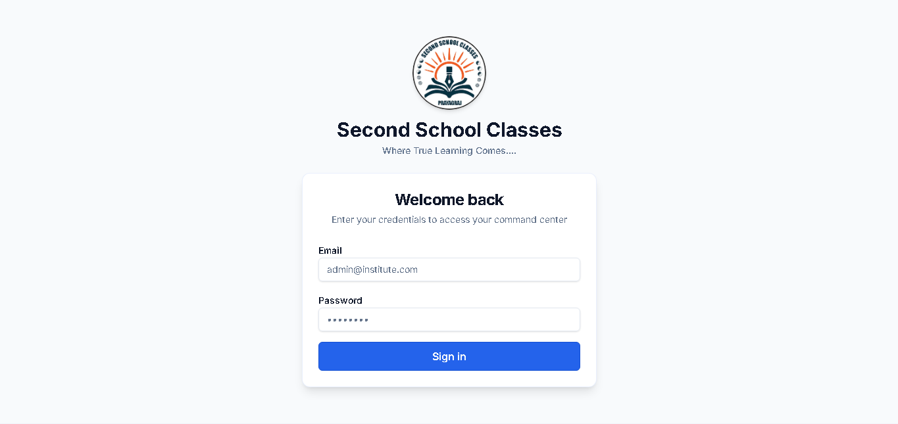
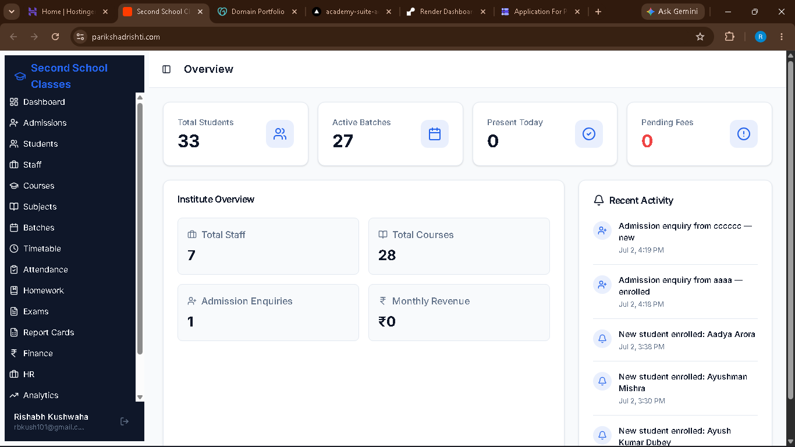
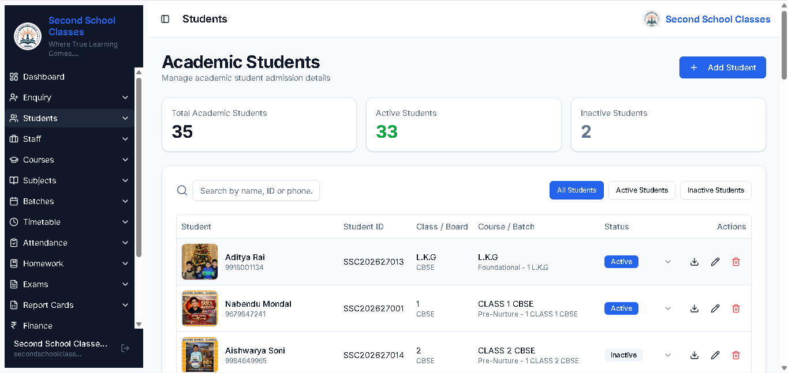
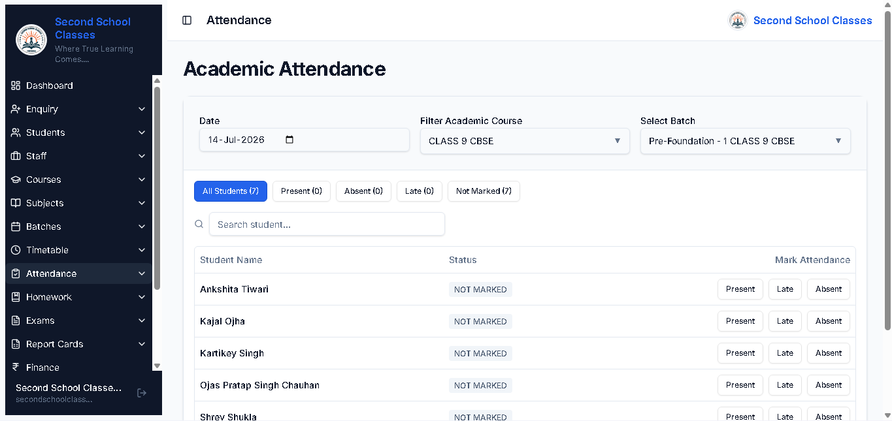
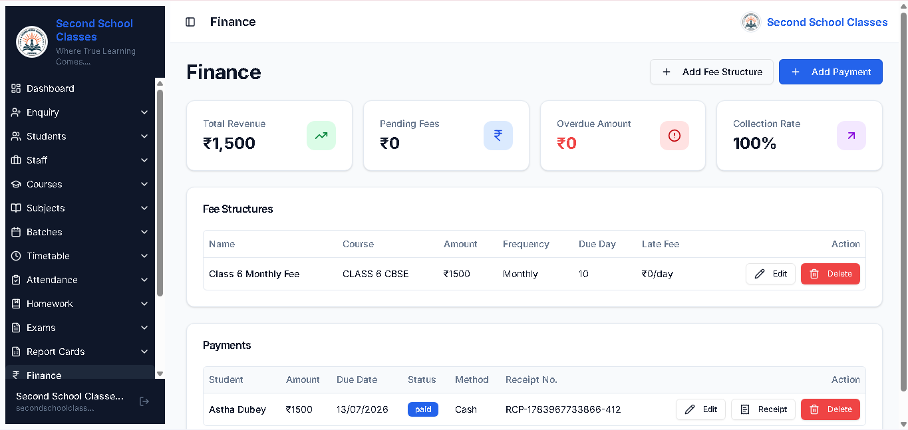
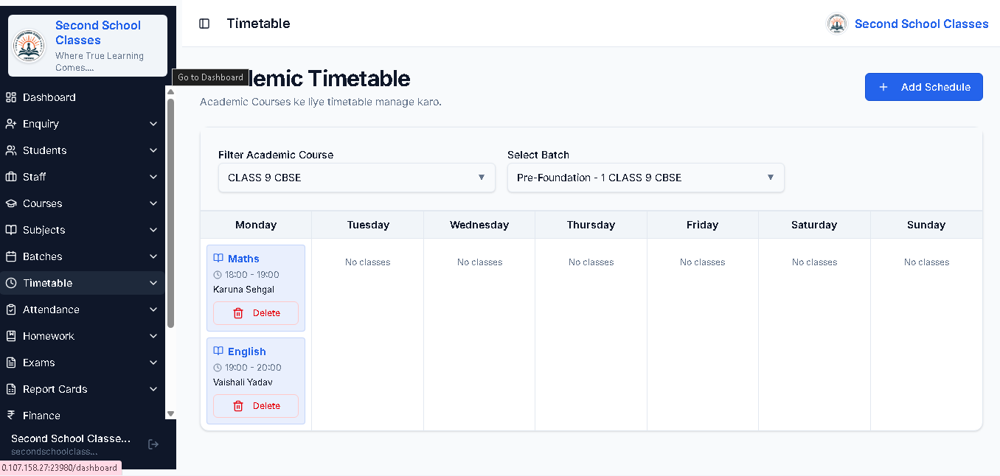

# 📚 ParikshaDrishti – Academy Management System


---


---

A production-ready **Academy Management System** built using the **MERN Stack (MongoDB, Express.js, React.js, Node.js)**.

🌐 **Live Demo:** https://www.parikshadrishti.com

⭐ **Status:** Active Development

📦 **Version:** v1.0

---

## 📖 About the Project

ParikshaDrishti is a production-ready Academy Management System built with the MERN Stack.

It enables educational institutes to manage students, enquiries, staff, attendance, courses, examinations, report cards, finance, homework, and timetables through a secure JWT-authenticated admin dashboard.

---

## 🔗 Quick Links

| Resource | Link |
|----------|------|
| 🌐 Live Demo | https://www.parikshadrishti.com |
| 💻 GitHub Repository | https://github.com/rbkush101-a11y/academy-suite |
| 👤 LinkedIn | https://www.linkedin.com/in/rishabh-kushwaha10 |

---

# 🚀 Project Highlights

- ✅ Production-ready MERN application
- ✅ Secure JWT Authentication
- ✅ RESTful API Architecture
- ✅ MongoDB Database Integration
- ✅ Responsive Admin Dashboard
- ✅ Live Deployment using Vercel & Render

---

# ✨ Features

- 🔐 JWT Authentication
- 👨‍🎓 Student Management
- 📝 Admission & Enquiry Management
- 👨‍🏫 Staff Management
- 📚 Courses & Subjects
- 👥 Batch Management
- ✅ Attendance Management
- 📖 Homework Management
- 📝 Examination Management
- 🎓 Report Cards
- 💰 Finance Management
- 📅 Timetable Management
- 📊 Analytics Dashboard
- 📱 Responsive Design

---

# 🛠 Tech Stack

| Layer | Technology |
|--------|------------|
| Frontend | React.js, HTML5, CSS3, JavaScript |
| Backend | Node.js, Express.js |
| Database | MongoDB |
| Authentication | JWT (JSON Web Token) |
| Deployment | Vercel, Render |
| Tools | Git, GitHub, VS Code, Postman, pnpm |

---

# 📸 Screenshots

## 🔐 Login Page



## 📊 Dashboard



## 👨‍🎓 Student Management



## ✅ Attendance



## 💰 Finance



## 🎓 Report Cards


## 📅 Timetable

 

---

## 📋 Prerequisites

Before running the project, make sure you have:

- Node.js
- pnpm
- MongoDB Atlas Account
- Git

---

# 🚀 Installation

## 1. Clone the Repository

```bash
git clone https://github.com/rbkush101-a11y/academy-suite.git
```

## 2. Go to the Project Directory

```bash
cd academy-suite
```

## 3. Frontend Setup

```bash
cd artifacts/academy-frontend
pnpm install
pnpm dev
```

## 4. Backend Setup

Open a new terminal and run:

```bash
cd artifacts/api-server
pnpm install
pnpm dev
```
---

# 📁 Project Structure

```text
academy-suite/
│
├── artifacts/
│   ├── academy-frontend/      # React Frontend
│   └── api-server/            # Node.js + Express Backend
│
├── images/                    # README screenshots
│
├── README.md                  # Project documentation
│
└── package.json
```

---

# ⚙️ Environment Variables

Create a `.env` file inside the backend folder and add:

```env
PORT=5000
MONGODB_URI=your_mongodb_connection_string
JWT_SECRET=replace_with_a_random_secret_of_at_least_32_characters
SUPER_ADMIN_EMAIL=admin@example.com
SUPER_ADMIN_PASSWORD=use_a_unique_password_at_least_12_chars
SUPER_ADMIN_NAME=Platform Administrator
```

The API requires a JWT secret of at least 32 characters. To create the first platform account, configure the three `SUPER_ADMIN_*` values and run `pnpm --filter @workspace/api-server create-super-admin`. The command never prints or resets an existing account's password.

Platform operators sign in at `/super-admin/login`; institute users continue to use `/login`. Access tokens are short-lived and the API rotates opaque refresh tokens in an HTTP-only cookie. For platform password recovery, configure `PUBLIC_APP_URL`, `AUTH_ENCRYPTION_KEY`, `AUTH_EMAIL_PROVIDER_URL`, `AUTH_EMAIL_PROVIDER_TOKEN`, and `AUTH_EMAIL_FROM`. The configured email endpoint must accept an authenticated JSON `POST` with `from`, `to`, `subject`, `text`, and `html` fields. Reset mail is queued and retried by the API worker; recovery returns an explicit service-unavailable error until delivery is configured. Use a different random value for the access-token key, throttle pepper, and email encryption key in production, and keep them outside source control.

When deploying behind a trusted reverse proxy, set `TRUST_PROXY_HOPS` to its exact hop count so login and audit IP fields use the client address. Configure the proxy to overwrite or normalize forwarded headers before enabling this setting.

For the frontend, create a `.env` file inside the frontend folder:

```env
VITE_API_BASE_URL=http://localhost:5000
```

> **Note:** Never commit your actual `.env` file or secret keys to GitHub.

---

# 🏗️ System Architecture

```text
                    User
                      │
                      ▼
          React.js Frontend
                      │
          HTTP / REST API
                      │
                      ▼
       Node.js + Express Backend
                      │
          JWT Authentication
                      │
                      ▼
              MongoDB Atlas
```

---

# 📡 API Endpoints

| Method | Endpoint | Authentication | Description |
|--------|----------|---------------|-------------|
| POST | /login | ❌ | User Login |
| GET | /students | ✅ | Get All Students |
| POST | /students | ✅ | Add New Student |
| PUT | /students/:id | ✅ | Update Student |
| DELETE | /students/:id | ✅ | Delete Student |
| GET | /attendance | ✅ | Get Attendance |
| POST | /attendance | ✅ | Mark Attendance |
| GET | /finance | ✅ | Finance Records |
| GET | /report-cards | ✅ | Student Report Cards |

---

# 🔮 Future Enhancements

- 👨‍👩‍👧 Parent Portal
- 👨‍🏫 Teacher Portal
- 🎓 Student Portal
- 💳 Online Fee Payment Gateway
- 📱 Mobile Application
- 🔔 SMS & Email Notifications
- 🏫 Multi-Branch Management
- 📊 Advanced Analytics Dashboard

---

# 👨‍💻 Author

**Rishabh Kushwaha**

Software Developer | MERN Stack Developer

📧 Email: rbkush101@gmail.com

🌐 Live Demo:
https://www.parikshadrishti.com

💻 GitHub:
https://github.com/rbkush101-a11y

🔗 LinkedIn:
https://www.linkedin.com/in/rishabh-kushwaha10

---

⭐ If you found this project helpful, consider giving it a Star on GitHub.

Contributions, suggestions, and feedback are always welcome.

---

# 🤝 Contributing

Contributions, issues, and feature requests are welcome.

If you would like to contribute:

1. Fork the repository
2. Create a feature branch
3. Commit your changes
4. Push the branch
5. Open a Pull Request  

---
